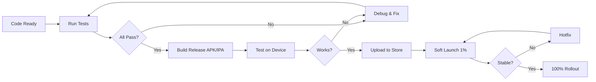

# 🏃 CÓMO EJECUTAR EJEMPLOS Y VALIDAR REDESIGN

## ⚡ Quick Start para Developers

### 1. Clonar y Setup
```bash
# Clonar repositorio (si no está hecho)
git clone <repo-url>
cd Rapidito-user-app

# Obtener dependencias
flutter clean
flutter pub get

# Opcional: Actualizar dependencias
flutter pub upgrade
```

### 2. Ejecutar App Completa
```bash
# iOS Simulator
flutter run -d iPhone14

# Android Emulator
flutter run -d emulator-5554

# Physical Device
flutter run -d <device-id>
```

### 3. Ejecutar Ejemplos de Componentes

#### Opción A: Desde main.dart (Recomendado para QA)
```dart
// En main.dart, cambiar home a:
import 'package:rapidito_user/examples/premium_components_examples.dart';

@override
Widget build(BuildContext context) {
  return MaterialApp(
    home: PremiumComponentsExamples(),  // ← Cambiar this
    theme: lightTheme,
    darkTheme: darkTheme,
  );
}
```

Luego ejecutar:
```bash
flutter run
```

#### Opción B: Desde Pantalla Home
```dart
// En home_screen.dart, agregar botón debug:
FloatingActionButton(
  onPressed: () => Get.to(() => PremiumComponentsExamples()),
  child: Icon(Icons.palette),
)
```

### 4. Testing Dark Mode

#### Desde Dispositivo iOS
1. Settings > Display & Brightness > Appearance
2. Select "Dark"
3. App cambia automáticamente

#### Desde Dispositivo Android
1. Settings > Display > Dark theme
2. Toggle "Dark theme"
3. App cambia automáticamente

#### Desde Code (Force Dark Mode)
```dart
// En main.dart
MaterialApp(
  themeMode: ThemeMode.dark,  // ← Force dark
  theme: lightTheme,
  darkTheme: darkTheme,
)
```

---

## 🔍 Validation Checklist para QA

### Pantalla: PremiumComponentsExamples

#### Tab 1: Colors & Text
- [ ] Paleta de colores visible
  - [ ] Primary (#00D9C0) mostrada correctamente
  - [ ] Success (#10B981) mostrada correctamente
  - [ ] Warning (#F59E0B) mostrada correctamente
  - [ ] Error (#EF4444) mostrada correctamente
  
- [ ] Typography hierarchy visible
  - [ ] Display Large más grande que Heading
  - [ ] Heading Large más grande que Body
  - [ ] Body Medium legible
  - [ ] Label Small para pequeños textos
  
- [ ] Spacing grid visible
  - [ ] XS (4px) pequeño
  - [ ] SM (8px) normal
  - [ ] MD (16px) medio
  - [ ] LG (24px) grande

#### Tab 2: Forms
- [ ] Text field básico
  - [ ] Label visible encima
  - [ ] Placeholder visible
  - [ ] Cursor visible al hacer tap
  - [ ] Texto se escribe correctamente
  
- [ ] Text field con error
  - [ ] Error message en rojo debajo
  - [ ] Borde rojo indicando error
  - [ ] Mensaje legible
  
- [ ] Premium card
  - [ ] Borde visible
  - [ ] Sombra visible
  - [ ] Contenido dentro legible
  - [ ] Background correcto según tema
  
- [ ] Glassmorphic card
  - [ ] Efecto blur visible
  - [ ] Borde visible
  - [ ] Efecto de "cristal" claro
  
- [ ] Buttons
  - [ ] Primary button tappable
  - [ ] Secondary button con outline
  - [ ] Loading button muestra spinner
  - [ ] Full width button ocupa todo el ancho
  - [ ] Ripple effect al hacer tap

#### Tab 3: Loading
- [ ] Shimmer card
  - [ ] Animación de shimmer visible
  - [ ] Altura ~150px
  - [ ] Animación fluida
  
- [ ] Shimmer avatar
  - [ ] Circular
  - [ ] Tamaño ~56x56
  - [ ] Shimmer animado
  
- [ ] Shimmer lines
  - [ ] Primera línea más larga
  - [ ] Segunda línea más corta
  - [ ] Ambas animadas
  
- [ ] Premium loader
  - [ ] Spinner rotando
  - [ ] Mensaje "Loading..." visible
  - [ ] Spinner color primario
  
- [ ] Progress circle
  - [ ] Círculo con borde
  - [ ] Porcentaje "65%" visible
  - [ ] Número visible en el centro
  
- [ ] Progress bar
  - [ ] Barra llena hasta 75%
  - [ ] Porcentaje visible
  - [ ] Colores correctos

#### Tab 4: Empty States
- [ ] No Data state
  - [ ] Icon visible (inbox)
  - [ ] Título "No Rides Yet"
  - [ ] Subtítulo "Book your first ride..."
  - [ ] Botón "Retry" funciona
  
- [ ] No Internet state
  - [ ] Icon de conexión
  - [ ] Mensaje claro
  - [ ] Botón retry funciona

#### Tab 5: Animations
- [ ] Fade in animation
  - [ ] Card aparece con fade
  - [ ] Animación suave
  - [ ] Texto visible al final
  
- [ ] Scale in animation
  - [ ] Card comienza pequeño
  - [ ] Escala hasta tamaño normal
  - [ ] Animación suave
  
- [ ] Slide in animation
  - [ ] Card entra desde lateral izquierdo
  - [ ] Animación fluida
  - [ ] Posición final correcta
  
- [ ] Pulse animation
  - [ ] Elemento pulse repetido
  - [ ] Escala visible (va y viene)
  - [ ] Ciclo continuo
  
- [ ] Staggered list
  - [ ] 3 items aparecen en secuencia
  - [ ] Cada item con delay
  - [ ] Último item al final aparece último
  
- [ ] Dialog button
  - [ ] Botón "Show Dialog Example" tappable
  - [ ] Dialog aparece con animation
  - [ ] "Yes, Proceed" funciona
  - [ ] "Cancel" cierra dialog

---

## 🎨 Visual Testing Guide

### Dark Mode Testing

#### Setup
```dart
// Force dark mode temporalmente
MaterialApp(
  themeMode: ThemeMode.dark,
)
```

#### Validación Visual
- [ ] Texto blanco en fondo oscuro (legible)
- [ ] Cards oscuras (cardBackground color)
- [ ] Buttons colores adaptados
- [ ] Icons color primary visible
- [ ] No texto gris oscuro en fondo oscuro
- [ ] Sombras sutiles (no desaparecen)
- [ ] Gradients visibles en tema oscuro

### Responsive Testing

#### Mobile (< 600px)
```bash
# Ejecutar en emulador pequeño
flutter run -d emulator-5554  # Adjust screen size to 400x800
```

Validar:
- [ ] Text no se corta
- [ ] Buttons full width
- [ ] Images escalan correctamente
- [ ] Cards ocupan 100% width menos padding
- [ ] No horizontal scroll

#### Tablet (600-900px)
```bash
# Ejecutar en emulador tablet
flutter run -d pixel-tablet
```

Validar:
- [ ] Layout distribuido en 2 columnas
- [ ] Márgenes laterales aumentados
- [ ] Text no muy grande ni muy pequeño
- [ ] Cards tienen máximo width

#### Desktop (> 900px)
```bash
# Ejecutar en emulador grande o window resizing
flutter run --desktop
```

Validar:
- [ ] Layout de 3+ columnas si aplica
- [ ] Márgenes grandes
- [ ] Elementos no ocupan todo el ancho

---

## 📊 Performance Testing

### Memory Profiling
```bash
# Abrir Android Studio Profiler
# Tools > Android Studio > Profiler

# Acciones a medir:
1. Abrir app completamente
2. Ver tab Colors & Text
3. Ver tab Forms
4. Ver tab Loading (shimmer animado)
5. Ver tab Animations (todas animadas)
6. Esperar 2 minutos con app en foreground
7. Revisar Memory graph
```

**Target**: Heap < 200MB, sin memory leaks

### Frame Rate Testing
```bash
# Habilitar performance overlay
flutter run -v

# En app, ver FPS indicator (esquina superior derecha)
# Durante:
- Swipe en Tab Bar
- Scroll en componentes
- Animaciones en Animations tab
```

**Target**: 60 FPS sostenido

---

## 🐛 Debugging Tips

### Errores Comunes

#### "No AppColors defined"
**Solución**:
```dart
// Asegurar import en el archivo
import 'package:rapidito_user/config/app_colors.dart';

// Verificar archivo existe:
// lib/config/app_colors.dart
```

#### "AnimationController not initialized"
**Solución**:
```dart
// Solo ocurre en widgets con state
// Asegurar initState y dispose:
@override
void initState() {
  super.initState();
  // animation controller initialization
}

@override
void dispose() {
  // animation controller cleanup
  super.dispose();
}
```

#### "Shimmer animation won't play"
**Solución**:
```dart
// Asegurar Shimmer.fromColors en lib/common_widgets/premium_shimmer.dart
// Verificar duration es positivo
// Verificar colors tiene 2 valores
```

### Logging para Debug
```dart
// Agregar en cualquier componente:
print('[DEBUG] Loading completed');
print('[DEBUG] Shimmer progress: $progress');

// Ver en console:
// flutter logs (en terminal)
// Logcat (en Android Studio)
```

---

## ✅ Validation Workflow Sugerido

### Para QA (1 hora)
1. **Setup** (10 min)
   - [ ] flutter clean && flutter pub get
   - [ ] flutter run -d <device>

2. **Visual Testing** (20 min)
   - [ ] Abrir PremiumComponentsExamples
   - [ ] Validar Tab 1: Colors & Text
   - [ ] Validar Tab 2: Forms
   - [ ] Validar Tab 3: Loading
   - [ ] Validar Tab 4: Empty States
   - [ ] Validar Tab 5: Animations

3. **Dark Mode Testing** (10 min)
   - [ ] Toggle dark mode en device
   - [ ] Re-validar visual appearance
   - [ ] Verificar texto legible
   - [ ] Verificar colores adaptados

4. **Responsive Testing** (15 min)
   - [ ] Rotación landscape
   - [ ] Escalar UI a 125% (accessibility)
   - [ ] Verificar no hay overflow

5. **Performance** (5 min)
   - [ ] Monitorear memory durante scroll
   - [ ] Verificar animaciones fluidas
   - [ ] Revisar no hay drops de FPS

### Para Developers (antes de commit)
1. **Lint & Analysis**
   ```bash
   flutter analyze
   ```
   
2. **Build Release**
   ```bash
   flutter build apk --release
   ```
   
3. **Run on Device**
   ```bash
   flutter run --release
   ```

4. **Verify Functionality**
   - [ ] Todos los controllers funcionan
   - [ ] Firebase se conecta
   - [ ] State management funciona
   - [ ] No crashes en home screen

---

## 📚 Archivos de Referencia Rápida

| Archivo | Propósito | Líneas |
|---------|-----------|--------|
| `QUICK_START.md` | Guía de uso rápido | ~200 |
| `REDESIGN_DOCUMENTATION.md` | Documentación completa | 400+ |
| `CHANGELOG.md` | Lista de cambios | 300+ |
| `DEPLOYMENT_CHECKLIST.md` | Pre-deployment checks | 500+ |
| `premium_components_examples.dart` | Pantalla de ejemplos | 400 |

---

## 🚀 Deployment Flow



---

## 📞 Support & Questions

Si encuentras problemas:

1. **Verifica QUICK_START.md** - Solución rápida
2. **Revisa REDESIGN_DOCUMENTATION.md** - Documentación completa
3. **Busca en CHANGELOG.md** - Cambios recientes
4. **Chequea code comments** - En cada componente

---

**Last Updated**: 2024  
**Version**: 2.0.0  
**Status**: Ready for QA 🚀
